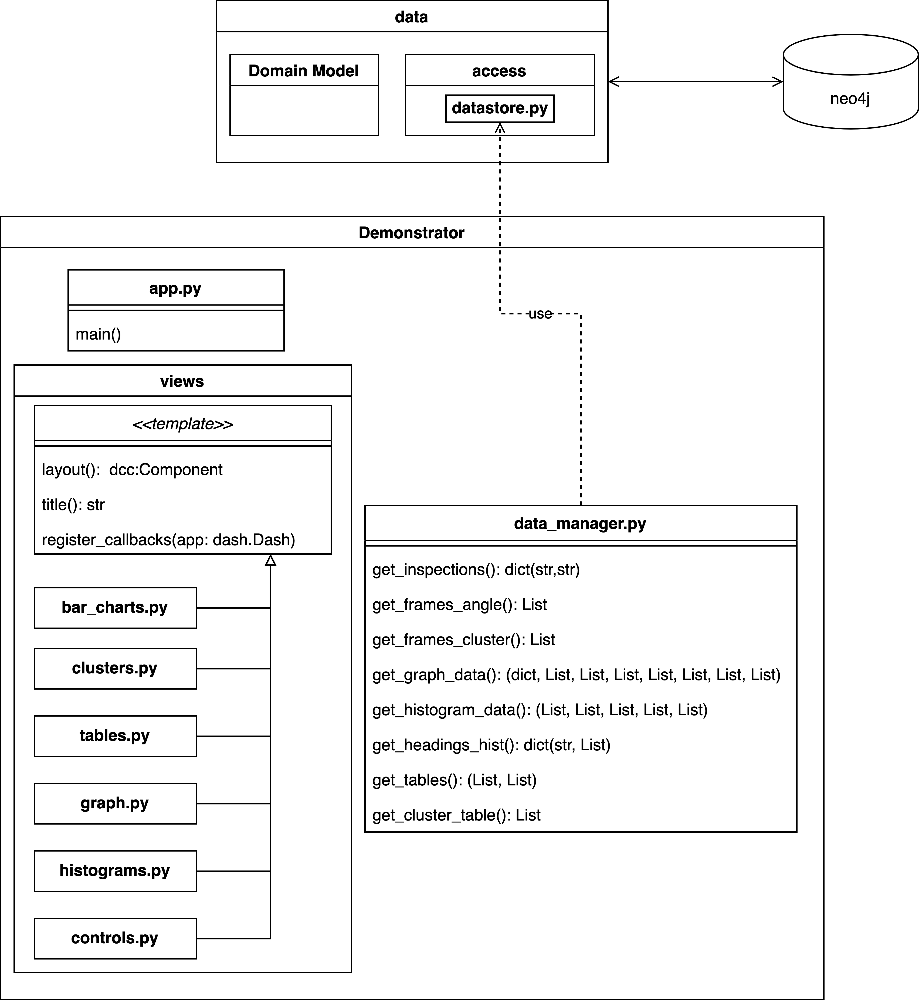

# Demonstrator
View deployed version at [liaci-context.sintef.cloud](https://liaci-context.sintef.cloud).

The deomonstrator web application provides different views on the data obtained from underwater ship inspections and enriched and contextualized by the tools in [/pipeline](../pipeline/).
As framework, plotly dash is used in the [community ediditon](https://github.com/plotly/dash).
The web application can be started by running the [`app.py`](./app.py) script with python. This will expose port 8051, which can be changed in the file.

The components of the demonstrator are summarized in the following diagram:

## Requirements
Requirements for running the pipeline can be found in the [requrements.txt](./requirements.txt) file.
|Requirement|Purpose|
|---    |---     |
|networkx==2.8|used for the graph layouting|
|py2neo==2021.2.3|neo4j database connector|
|plotly==5.7.0|web application framework plotly|
|dash-cytoscape==0.3.0|web application framework plotly|
|dash==2.3.1|web application framework plotly|
|dash-html-components==2.0.0|web application framework plotly|
|uvicorn==0.18.3|used to run the web application|

## Assets
To run and host the demonstrator, data is required as generated by the tools in [/pipeline](../pipeline/) in this repository. The two required assets are 1) a neo4j dump of the graph database and 2) thumbnail images of all the stored frames in .png or .jpg format. Strictly speaking the latter is not required to see some data, however seeing the actual data from the inspections plays a quite important role in the application.

## Deployment archtiecture
The demonstrator application consists of two deployed services.
One of them is the neo4j database, which is only acessed for efficient data retrieval and the other is the dash web application.
Details about the suggested deployment are provided in the corresponding documentation in [./deployment](./deployment/).

## Data management
Thanks to the plotly framework, no real distinction is possible between frontend and backend code since the frontend code is generated but defined by the code that runs on the backend.
However, the callbacks use the datastore api from the [data layer](../README.md#architecture) of this repository.
All data retrieval queries are defined in the [`data_manager.py` script](./data_manager.py). 

|Method|Callee(s)|Return value|
|-|-|-|
|`get_inspections(filter_options)`|controls.py,bar_charts.py|*dict(str, str)* Where the key is a human readable string to identify an inspection, e.g. 'Aberfoyle I on 2022-02-21' and the key is the id of the inspection in the neo4j database|
|`get_frames_angle(inspection_id, heading, filter_options)`|bar_charts.py|*List(dict(str, Any))* Queries and returns all frames for the given inspection and heading. Returns a dict with the keys 'path' and 'uciqe' with the respective values for every frame.|
|`get_frames_cluster(inspection_id, cluster_id)`|clusters.py|*List(dict(str, Any))* Queries and returns all frames for the given inspection and cluster. Returns a dict with the keys 'path' and 'uciqe' with the respective values for every frame.|
|`get_graph_data(filter_options)`|graph.py|An eight-tuple of all data that is required to display the graph. See [graph data](#graph-data)|
|`get_histogram_data(filter_options)`|histograms.py|A five-tuple of all histogram data. See [histogram data]
|`get_headings_hist(filter_options)`|bar_charts.py|*dict(str, dict(str, float))* The key of the first layer dictionary is the inspection id to be able to show seperate histograms for each selected inspection. The inner dictionary contains the keys 'headin' and 'count' with the respective values. The orientation of the frames is already normalized with the magnetic heading of the ship during the inspection.|
|`get_tables(filter_options)`|tables.py|*(List(dict(str, Any)), List(dict(str, Any)))* Two lists for both tables as shown in the tables view. The inner dictionaries contain the column name as key and the data as values.|
|`get_cluster_table(filter_options)`|clusters.py|*List(dict(str, Any))* List of clusters. The dictionaries include the following keys with the respective data: 'cluster' (cluster number),'inspection_id', 'id','size','key_frame' (path) and 'keywords'|

### Graph data
The graph data consists of the following returned as a tuple from the `get_graph_data` method of the data manager.

|title|data type|content|
|-|-|-|
|nodes|*dict(str, dict(str, Any))*|All nodes to display in the kowledge graph. This includes frames, mosaics, clusters, inspections, ships and ship parts. Key of the dictionary is the id of the node in the neo4j database. The second dictionary contains **all** properties of the nodes that are in the neo4j database. They are displayed on the right side of the graph view when a node is selected.|
|in inspection|*List((str, str))*|All in inspection relations in the nodes. The strings in the tuple correspond to the id in the neo4j database and also the keys in the *nodes* dictionary above.|
|similar to|*List((str, str))*|All similar to relations between frames. Same format as above.|
|visually similar to|*List((str, str))*|All visually similar to relations between the frames. Same format as above.|
|in mosaic|*List((str, str))*|All in mosaic relations between frames and mosaics in the data. Same format as above.|
|in cluster|*List((str, str))*|All in cluster relations between frames and clusters. Same format as above.|
|shows part|*List((str, str))*|All shows part relations between frame nodes and classification nodes. Same format as above.|
|part of ship|*List((str, str))*|All part of ship relations between part nodes and ship nodes. Same format as above.|

### Histogram data
The histogram data consists of the following returned as a tuple from the `get_histogram_data` method of the data manager.
The data type is a list for all five tuple entries containing all the data points. The assignment to bins can then be done dynamically by the plotly dash framework.

|title|content|
|-|-|
|quality histogram|UCIQE values for all frames of the given filter options. However, the image quality filter option is ignored.|
|marine growth histogram|marine growth percentage for all mosaics of the given filter options. Here the option if mosaics are displayed in the graph view or not is ignored.|
|depth histogram|Depth values for all frames of the given filter options.|
|similarity histogram|Distances of similarities between the frames. The similarity threshold in the filter options is ignored.|
|visual similarity histogram|As above but for visual similarities.|