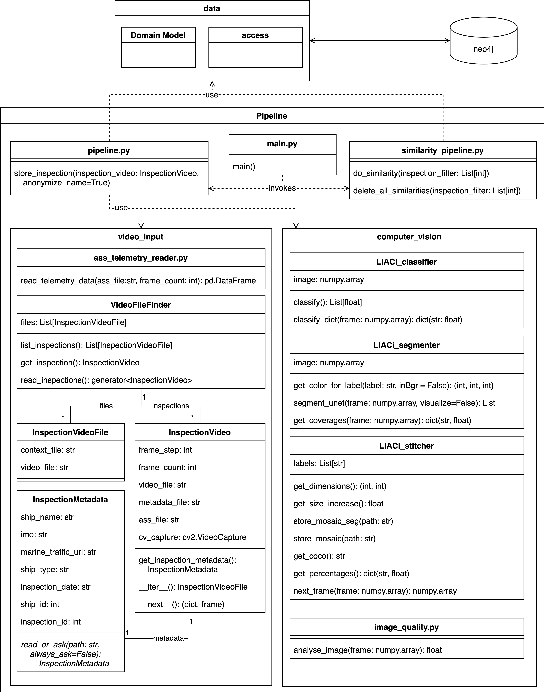

# LIACi contextualization pipeline
## Concept
The concept of the pipeline is summarized in the following figure:


## Requirements
Requirements for running the pipeline can be found in the [requrements.txt](./requirements.txt) file.
|Requirement|Purpose|
|---    |---     |
|opencv-python==4.5.5.64|for reading the frames from the video to an array like format|
|onnxruntime-gpu==1.12.1|GPU accelerated runtime for the machine learning models|
|Pillow==9.1.1|for further image processing like image colors|
|ass==0.5.2|.ass file parser for telemetry data of inspection videos|
|pandas==1.4.2|used for interpolation of missing values in ass files|
|scipy==1.8.0|includes the KD-Tree datastructures|
|matplotlib==3.5.2|for plotting stuff, was mainly used to analyze different PCA parameters, not used anymore|
|py2neo==2021.2.3|neo4j database connector|
|scikit-learn==1.0.2|includes many required algorithms like t-SNE, PCA, DBSCAN, KNN|
|pycocotools==2.0.4|used to generate coco formatted strings from segmentation masks to store in the neo4j database|
|imreg_dft==2.0.0|required by im2vec|
|torch==1.12.0|required by im2vec|
|torchvision==0.13.0|required by im2vec|
|img2vec-pytorch==1.0.1|includes the Resnet18 model to get image vectors|
|dataclasses-json==0.5.7|used to create json serializable dataclasses|
|click==8.1.3|framework used to create the CLI application|

## Modules
The pipeline is implemented in different modules with different tasks. 
These modules are:
- Python [click](https://click.palletsprojects.com/en/8.1.x/) application as single CLI entrypoint
- inference pipeline (pipeline.py)
- similarity and contextualization pipeline (similarity_pipeline.py)
- video input ([./video_input](./video_input))
- computer vision ([./computer_vision](./computer_vision))

The modules use the data layer for data management and persistence.
An overview is given by the following diagram:



### main.py - CLI entrypoint
For good usability of the pipeline, an entrypoint has been implemented based on the [python click framework](https://click.palletsprojects.com/en/8.1.x/).
The "command line interface creation kit" has interesting features and allows programmers to easily create a command line tool.
It provides a parser for arbitrary and nested command line arguments with advanced checks that are already implemented.
Command line arguments that are paths for instance can directly be checked for existence or access rights.
Click also automatically generates useful help pages based on comments in the source code.

Click programs can easily be created from existing python scripts by using decorators for methods.
To make a method executable from the command line, the click.command decorator is used without parameters.
Then options and arguments can be added by adding the respective decorators.
They are passed to the method as positional arguments in the order of their appearence in the source code.
Options reuire a parameter declaration while arguments are assigned based on their position.
This is comparable with pythons positional arguments (arguments) and named arguments (options).
As usual for many years in unix programs, the parameter declaration always begins with the literal - for shorthand declarations or -- for the long version.
Options are followed by their value unless they are defined as flags with the isFlag key-word argument in the decorator.
Then no value is parsed and a boolean value is provided as parameter if the flag is set or not.

The main use case of the command line tool in main.py is to invoke the inference pipeline for the analysis of the inspection video and the similarity pipeline for the calculation of similarities and clusters in the inspection data.
There are however several other utilities that are implemented by the main.py script.
The following list includes all available commands that are included:
|Command|Effect|
|-|-|
analyze| run the inference pipeline and store everything into neo4j
similarities| run the similarity and clustering pipeline and store the results to neo4j
clear| delete data from the neo4j graph database
list| list all availalable inspections that have the correct data format and can be analyzed
stitcher-demo| show a demonstration of the video stitching

Further details about these commands and their options will be given in the following sectioins:

#### analyze
```
Usage: main.py analyze [OPTIONS] PATH

  Analyze inspection video(s) and store data to neo4j. Does not analyze
  simiarities and clusters, this is done with the command simiarities.

  PATH Path to the video files. All subfolders will be searched. Inspections
  need to have an .mp4 video file and a .ass metadata file with the same name.

Options:
  --dry-run   Dont analyze inspections, only check if inspection metadata is
              provided. It's recommended to run this before analyzing a bunch
              of inspections as otherwise user interaction to provide metadata
              on the CLI will be required for each new inspection.
  --metadata  Always aks for metadata even if it is available. To correct
              errors made when providing it before.
  --help      Show this message and exit.
  ```
After running, the given directory or file is analyzed for inspections that fulfill the criteria. Then a list is presented to the user and the user needs to select one or many inspections to analyze. If no inspections are chosen or the index is out of range, the program is aborted.
```
$ python main.py analyze ../..
0 : ../../*****/2021-02-09_11.34.29.mp4,      2819.03MB video,         1.84MB context
1 : ../../*****/2021-02-09_12.20.57.mp4,      1197.21MB video,         0.78MB context
2 : ../../*****/2022-02-08_11.31.28.mp4,      4448.58MB video,         3.13MB context
3 : ../../*****/2021-08-27_09.18.27.mp4,       477.65MB video,         1.87MB context
4 : ../../*****/2021-09-08_09.49.00.mp4,       701.40MB video,         2.29MB context
5 : ../../*****/2021-09-01_19.32.04.mp4,      1994.89MB video,         3.29MB context
6 : ../../*****/2021-11-30_12.46.08.mp4,      6663.91MB video,         4.67MB context

Select one or many videos (comma seperated). Type 'a' for all videos.
```
### similarities
```
Usage: main.py similarities [OPTIONS]

  Analyze previously stored inspections for similarities and clusters.

Options:
  --help  Show this message and exit.
```
At run, the stored inspections are listed and the user must choose one or many to start the analysis. If no selection is chosen or the index is out of range, the program is aborted.
```
$ python main.py similarities
0  : Amphion I on 2021-02-09 with id 747458
1  : Amphion I on 2021-02-10 with id 373604
2  : Amphion I on 2022-02-08 with id 753417
3  : Cambridge I on 2021-08-27 with id 854352
4  : Fastnet I on 2021-09-08 with id 287337
5  : The on 2021-09-01 with id 280278
6  : The on 2021-11-30 with id 194011
Select one or many videos (comma seperated). Type 'a' for all videos.
```
### clear
To clear data from the neo4j database, the clear command is used. 
The user has to specify which kind of data should be removed.
Therefore either `similarities` or `nodes` has to follow the command.
The option `similarities` deletes similarities as well as cluster or in other words reverts the similarities command.
The option `nodes` deletes all data that is assigned to the respective inspection(s) from the database, so in other words reverts both the similarities command as well as the analyze command.
```
Usage: main.py clear [OPTIONS] {similarities|nodes}

  Delete whole inspections or similarities and clusters of inspections from
  the neo4j database.

  {similarities|nodes} Choose nodes for whole inspections and similarities to
  only delete clusters and similarities.

Options:
  --all   Use faster queries for deleting all inspections.
  --help  Show this message and exit.
```
The same list as in [similarities](#similarities) is presented to the user. If the `--all` flag is selected, faster cypher queries are used to not distinguish between individual inspections.
### list
Only list the inspections that are available for the analyze command. The user could achieve the same thing by typing the command analyze and not choosing an inspection so that no analysis is started.
```
Usage: main.py list [OPTIONS] PATH

  List the available inspections for analysis.

  PATH Path to the video files. All subfolders will be searched. Inspections
  need to have an .mp4 video file and a .ass metadata file with the same name.

Options:
  --help  Show this message and exit.
```
```
$ python main.py list ../..
0 : ../../****/2021-02-09_11.34.29.mp4,      2819.03MB video,         1.84MB context
1 : ../../****/2021-02-09_12.20.57.mp4,      1197.21MB video,         0.78MB context
2 : ../../****/2022-02-08_11.31.28.mp4,      4448.58MB video,         3.13MB context
3 : ../../****/2021-08-27_09.18.27.mp4,       477.65MB video,         1.87MB context
4 : ../../****/2021-09-08_09.49.00.mp4,       701.40MB video,         2.29MB context
5 : ../../****/2021-09-01_19.32.04.mp4,      1994.89MB video,         3.29MB context
6 : ../../****/2021-11-30_12.46.08.mp4,      6663.91MB video,         4.67MB context
```
### stitcher-demo
Implemented for demonstration purposes only. If you want to run this, you need to change a path in LIACI_stitcher.py.
Produces beautiful outputs like the following:


## pipeline.py
The python file [pipeline.py](pipeline.py) includes the sourcecode of the inference pipeline. 
The pipeline itself is contained in a single long method called `store_inspection`.
It requires a `VideoInspection` object as parameter and invokes the following algorithms and operations:
- Read every frame of the video and try to stitch to the current mosaic
- Run the image classifier
- Run the image segmentation model
- Run the image quality estimation metric 
- Create enriched data of each 30th frame (telemetry data, computer vision results) and store the frame to neo4j 
## similartiy_pipeline.py
The file [similarity_pipeline.py](similarity_pipeline.py) contains the sourcecode of the similarity and cluster pipeline.
This includes the following operations:
- Resnet18 model to get image features
- Principal component analysis
- t-stochastic neighbourhood estimation
- K-nearest-neighbour search for similarities
- DBSCAN clustering 
- Add similarities, clusters, 
## computer_vision
See detailed documentation of this module [here](./computer_vision/)
## video_input
See detailed documentation of this module [here](./video_input/)