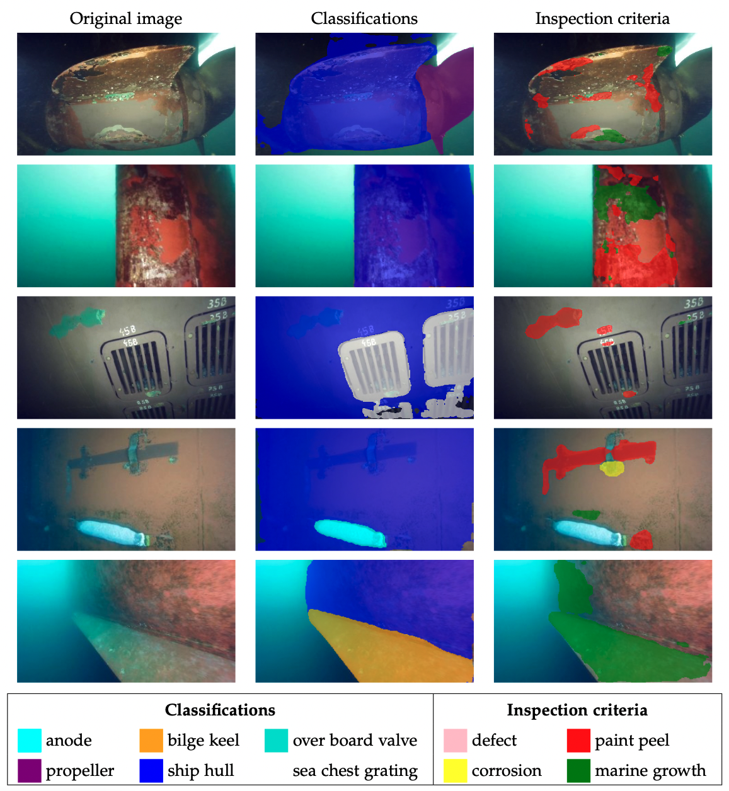

# Computer Vision
This module contains classes that provide interfaces for the different computer vision tasks that the inference pipeline requires.

**Model files**: For the image segmentation and the image classification, which is also used by the image stitching, pretrained models have to be provided.
The weights need to be in onnx formats and the labels in a .txt file in a directory called `modelzoo` in the `computer_vision` directory.
The model (`model.onnx`) and labels (`labels.txt`) for the classifier and segmenter have to be in a subfolder called `LIACi_classifier` and `LIACi_segmenter` respectively.

## Image quality
The [`image_quality.py`](./image_quality.py) file includes a method to assess the image quality.
The implementation is drawn from [https://github.com/xueleichen/PSNR-SSIM-UCIQE-UIQM-Python](https://github.com/xueleichen/PSNR-SSIM-UCIQE-UIQM-Python) and was simplified to be able to calculate the UCIQE quality estimation metric faster.

The calculation can be started using the `analyse_image` method with the image array as input parameter.
The method returns the UCIQE quality estimation metric as a float value.

## Image Stitching
The `LIACI_Stitcher` class contained in [`LIACI_stitcher.py`](./LIACI_stitcher.py) provides an interface to stitch images to a larger field of view.
It can be initialized with an optional list of labels to analyze the segmentation result for.
If no labels are provided the default list 
```
['paint_peel', 'marine_growth', 'corrosion', 'ship_hull', 'sea_chest_grating', 'over_board_valve']
```
will be used.

Frames are added to the mosaic with the method `next_frame` which returns the [homography matrix](https://en.wikipedia.org/wiki/Homography_(computer_vision)) of the frame or `None` if the frame could not be added to the mosaic.

At any time, the mosaic and the version with segmentation overlay can be stored using the `store_mosaic` and `store_mosaic_seg` methods.
They require a path where to store the image.

In the pipeline, mosaics are only stored if they enlarge the field of view to a decent extend.
The relative size increase of the mosaic compared to the first provided frame can be obtained with the method `get_size_increase`.
Relevant information about the mosaic, that are stored int the neo4j database can be queried with the following methods:
|Method|Return value|
|---   |---   |
`get_dimension`|get the dimension of the resulting mosaic. This is required in order to be able to turn the coco strings back to segmentation masks and is a tuple containing width and height of the mosaic.|
|`get_coco`|get the [coco](https://cocodataset.org/#format-data) and base64 encoded string for the segmentation mask (or better polygons obtained from the segmentation mask)|
|`get_percentatges`|returns a dictionary that maps the labels provided in the initializer of the class to the percentage to which extend they are detected on the resulting mosaic by the image segmentation model|
## Image Segmentation
The class [`LIACi_segmenter`](./LIACi_segmenter.py) contains required code to run and analyze the image segmentation model.
The user may choose between different return vales which include either a list of boolean masks, a list of bounding boxes or the percentages of coverage of the frame.

The file also includes a demonstration method that is discussed [here](../README.md#stitcher-demo).

If ran as main file, a single image can be analyzed. Therefore the path to the image file needs to be provided as command line argument. Optionally the flag `-s` can be provided as additional argument which will result in the image as well as the segmentation will be stored in three filed: One containing the original image, one the segmentation of inspection criteria and one the segmentation of ship parts.

Here are some examples for the Image segmentation model:



## Image classification
Image classification is handeled by the class [`LIACi_classifier`](./LIACi_classifier.py).
It provides two methods: `classify` which runs the classification and returns a list of scores for the classes provided by the model and `classify_dict` which also runs the model but returns a dict which has the labels as keys and the scores as values.
Both methods as well as the initializer of the class can be provided with the frame as numpy array, resulting in an override of the current one.

