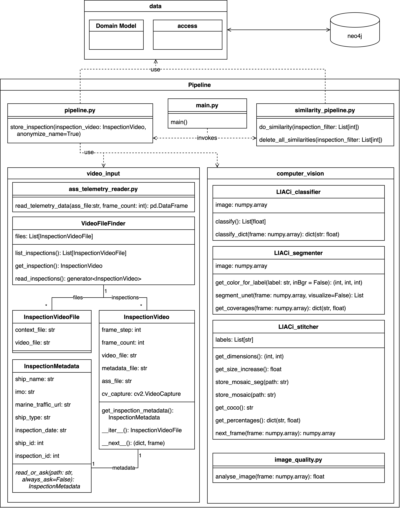

# video input module
This module contains all required source code to read videos from file frame wise and provide an array of RGB values for further processing.
Additionally, the handling of telemetry data and the fusion of the image arrays and telemetry vectors is handeled in this module.
As a result, the class `VideoInspection` provides a neat iterator interface yielding both the frame arrays for a video as well as the telemetry data.
An overview of the components is provided in the following diagram:

## ass_telemetry_reader.py
Provides methods to read the telemetry data in ass format from a file and provide a pandas DataFrame which is an array like structure, containing telemetry data for each frame.
The ROV is not recording telemetry data with the same rate as the video frames are recorded, but rather with a lower frequency.
This frequency varies from ROV to ROV and for the correct use of telemetry data in the downstream of the pipelines, the missing data has to be interpolated.

## VideoInspection
Provides a convenient iterator for inspection video frames and telemetry vectors.
Objects of this class can be processed by the inference pipeline.
With the property `frame_step` determine, the user if every frame of the video should be processed or if frames should be skipped and how many.
If the property is set to 1, every frame of the video is yielded, if it is set to 30, every 30th frame will be yielded.
VideoInspections keep an Object of the type InspectionMetadata.
## InspectionMetadata
Objects of this type contain static metadata about the inspection that can not be read from the inspection file.
These have to be provided by the user and include:
- The name of the ship under inspection
- The imo of the ship under inspection
- The marine-traffic-url 
- The ships' type
- The inspection date

Additionally from the ships name and inspection date, identifiers for the ship and inspection are calculated which do not need to be provided by the user.

An `InspectionMetadata` object can be instanciated by using the method `read_or_ask` which searches for a json file that contains the required information.
If no file is found, or the file does not contain sufficient information, the user is asked the respective data on the command line and the file is created and written.

## VideoFileFinder
The class `VideoFileFinder` is a utility class that facilitates the listing of available inspections and creation of `InspectionVideo` instances.
It is instanciated with the required path to search for inspection videos.
First, the method `list_inspections()` returns a list of `InspectionVideoFile` instances for the given path.
These instances can then be used to get an instanciated `InspectionVide` with the method `get_inspection`.
A third option is the method `read_inspection()` which reads all inspections in the path and directly yields `InspectionVideo` instances.